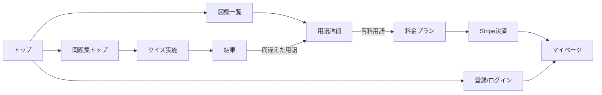

# 03. 画面設計（子ドキュメント）

> 親: [00_要件定義書.md](./00_要件定義書.md)

---

## 1. 画面一覧

| # | 画面名 | URL案 | ログイン | 優先度 |
|---|---|---|---|---|
| S-1 | トップページ | `/` | 不要 | MVP |
| S-2 | 図鑑一覧・検索 | `/zukan` | 不要 | MVP |
| S-3 | 用語詳細 | `/zukan/[slug]` | 不要（一部有料） | MVP |
| S-4 | 問題集トップ（モード選択） | `/quiz` | 不要 | MVP |
| S-5 | クイズ実施 | `/quiz/[mode]` | 一部有料 | MVP |
| S-6 | クイズ結果 | `/quiz/result` | - | MVP |
| S-7 | 会員登録 / ログイン | `/signup` `/login` | - | MVP |
| S-8 | マイページ（お気に入り・進捗） | `/mypage` | 必要 | MVP |
| S-9 | 料金プラン・購入 | `/pricing` | - | MVP |
| S-10 | 設定（プラン管理・退会） | `/settings` | 必要 | MVP |
| S-11 | 利用規約 / プラポリ / 特商法 | `/terms` など | 不要 | MVP |
| S-12 | 管理画面（用語・問題の登録） | `/admin` | 管理者 | MVP（簡易でOK） |
| S-13 | ~~学習マップ（必修ロード）~~ → **すごろく学習に吸収・廃止** | `/map`（→`/learn`へリダイレクト） | — | ✅廃止（roadmap.ts削除） |
| S-14 | すごろく学習（教材→テスト8割で進む） | `/learn`, `/learn/[nodeId]` | 不要（端末ローカル記録） | ✅実装済み |
| S-15 | コース目次（全章一覧・続きから再開） | `/curriculum` | 不要 | ✅実装済み |
| S-16 | レッスン弱点復習（誤答だけ再挑戦） | `/learn/review` | 不要 | ✅実装済み |

> S-14 すごろく学習: キャラ（コクリ）が物語形式でレッスンを進め、章ごとに「アウトプットテスト」で**8割正解すると次のマスが解放**。**現在29章/117ノード**（初級6・中級11・上級12）を3レベルのコース制で実装（`src/data/journey.ts`、順序は `chapters` 配列順、a3が最終章）。各レッスンは写経コード(`codeSample`)・ミニ練習(`practice`)・図鑑相互リンク(`relatedSlugs`)、テストは合格後の深掘り(`deepDive`)＋バッジ獲得(`awards.ts`)。進捗は localStorage `cocre:journey:v1`（ログイン時 `journey_progress` へ同期）。**旧「必修コース(roadmap)」は廃止し各レッスン末尾の図鑑導線に吸収**。用語は298語で**全語デモ実装済み（デモ100%）**。

> オンボーディング: 初回訪問時に**スポットライト型ガイドツアー**（`GuidedTour.tsx`）。ヘッダーnav等の実要素（`data-tour`属性）を暗転の中で光らせ、矢印付き吹き出しで「図鑑→問題集→マップ→マイページ」を順に案内。スキップ可。フッターの「使い方をもう一度見る」やヘルプから再表示（`HelpButton.tsx`、localStorage `cocre:tour-done:v1`）。

---

## 2. 主要画面の構成

### S-2 図鑑一覧・検索
```
┌──────────────────────────┐
│ 検索バー（用語名で検索）              │
│ [カテゴリ▼] [難易度▼] [五十音順▼]     │
├──────────────────────────┤
│ ┌────┐ ┌────┐ ┌────┐        │
│ │画像  │ │画像  │ │画像  │  ← カード │
│ │用語名│ │用語名│ │用語名│    グリッド│
│ │一言  │ │一言  │ │🔒有料│        │
│ └────┘ └────┘ └────┘        │
└──────────────────────────┘
```
- カードに**画像を必ず表示**し、見た目から用語を覚えられるようにする
- 有料用語は🔒マーク＋タップで料金ページへ誘導

### S-3 用語詳細
```
┌──────────────────────────┐
│ ハンバーガーメニュー (Hamburger Menu) │
│ 読み: はんばーがーめにゅー  [♡お気に入り]│
├──────────────────────────┤
│ ［実例画像：実際のUIスクショ］         │
├──────────────────────────┤
│ ■ 一言でいうと                    │
│ ■ 詳しい説明                     │
│ ■ どんな時に使う？                 │
│ ■ サンプルコード                   │
│ ■ 関連用語: [ナビ] [ドロワー]        │
│ [✓ 覚えた]                       │
└──────────────────────────┘
```

### S-5 クイズ実施（4択の例）
```
┌──────────────────────────┐
│ 初心者モード  Q3/10                │
├──────────────────────────┤
│ ［画像：あるUI部品のスクショ］        │
│ この部品の名前は？                  │
│ ○ モーダル      ○ トースト          │
│ ○ アコーディオン  ○ カルーセル        │
└──────────────────────────┘
```

### S-13 学習マップ（廃止・すごろく学習に統合）
> **2026-07 廃止**。旧「必修ロード(`src/data/roadmap.ts`)」を上から辿るDuolingo風マップは、
> S-14 すごろく学習（`/learn`）に統合し、`roadmap.ts` / `LearningMap.tsx` は削除。`/map` は `/learn` へリダイレクト。
> 「実物を見る」役割は各レッスン末尾の図鑑導線（`LessonNode.relatedSlugs`）に吸収した。
> 用語詳細を開くと「読んだ（seen）」印がつく仕組み（localStorage `cocre:seen:v1`／ログイン時 `seen_terms` へ同期）は継続。

---

## 3. 画面遷移（主要フロー）



- **「間違えた問題 → 該当用語の図鑑ページへ」**の導線が学習の要
- 未ログインでもクイズ体験→結果保存のタイミングで登録を促す
