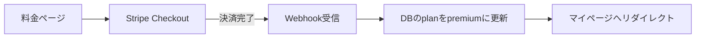

# 05. サブスク課金設計（子ドキュメント）

> 親: [00_要件定義書.md](./00_要件定義書.md)

---

## 1. 収益モデル：フリーミアム型サブスク

無料で価値を体験してもらい（集客・SEO）、「もっと学びたい」タイミングで有料化する。

## 2. プラン案

> 方針転換（2026-07-18）: **学習コンテンツそのもの（中級・上級コース）を課金の主軸にする**。
> 従来の「弱点復習・AI無制限・広告なし」は付随価値に格下げし、「作れる人になるコース」がVIPの背骨。

> **推奨価格（2026-07-18・変更容易）**：VIP 月額 **¥680** / 年額 **¥5,980**（実質約498円/月・約2.7ヶ月分お得）、
> 中級・上級コース **買い切り ¥9,800**（一回課金）。数値は `src/app/vip/page.tsx` の `PRICE` に定義。ローンチ時は早期割引で下げてよい。

| | 無料プラン | VIP（月額¥680 / 年額¥5,980） | 中級・上級コース 買い切り（¥9,800・案） |
|---|---|---|---|
| 図鑑閲覧 | 全用語（調べるは開放） | 全用語 | 全用語 |
| 用語検索 | ○ | ○ | ○ |
| **初級コース**（用語を知る） | ○ | ○ | ○ |
| **中級コース**（HTML/CSS/JSを書く） | 入口の第1章(m1)のみ | 全章 | 全章 |
| **上級コース**（React・Git・現場） | × | ○ | ○ |
| 弱点復習（間違いだけ集中） | × | ○ | ○ |
| AIでしらべる / AIに質問 | 1日1回お試し | 無制限 | **お試しのみ**（継続コストのため付けない） |
| 成績・学習履歴 | ローカルのみ | クラウド同期 | クラウド同期 |
| 広告 | あり | なし | なし |

- **無料の入口を厚く**：初級コース全部＋中級の第1章（HTMLを書いてみる）まで無料で“作る楽しさ”を体験 → 続きでVIP転換。
- 買い切りは**コンテンツ閲覧の永続開放**に限定し、AI無制限のような継続コスト機能は含めない（サブスクとの差別化・原価防衛）。
- 価格は**要確認事項Q3**。年額プラン（2ヶ月分お得: 6,800円/年 など）も用意すると解約率が下がる（承認済み）
- ローンチ時の早期割引「先着◯名は永久◯%オフ」を実施（承認済み）
- 学生向け割引はフェーズ2で検討
- **スクール・専門学校向けチームプラン**（一括契約・高単価）: 個人向けが軌道に乗ったら営業（承認済み・フェーズ2）

### コース体系（レッスン = `src/data/journey.ts`・現在30章/121ノード）
> 章の順序は `chapters` 配列の並び順（id順ではない）。**a3(AI)が全体の最終章**。

| レベル | 章（順） | 内容 | アクセス |
|---|---|---|---|
| 初級 BEGINNER | c1〜c6 | AI/プログラミング入門〜UI用語〜予約サイトを組む | 無料 |
| 中級 INTERMEDIATE | b1・m1 | コードを書く準備 / HTMLを書く | **無料お試し** |
| 中級 INTERMEDIATE | m2,m3,m9,m4,m10,m5,m6,m11,m7,m8 | CSS / JS / 配列 / データ取得 / API実践 / フォーム / 状態 / ローカル保存 / Tailwind / デバッグ | VIP |
| 上級 ADVANCED | a1,a2,a4,a5,a6,a7,a8,a9,a10,a11,a3 | 部品(React) / 道具(Git等) / テスト / 速く / a11y / Git実践 / セキュリティ / 型(TS) / デザイン4原則 / SEO / AIと組む開発 | VIP |

- 章に `level`（beginner/intermediate/advanced）と `access`（free/vip）を持たせ、ロック判定は `isChapterAccessible()` で行う。中級はb1・m1のみ無料お試し、以降と上級は全てVIP。
- レッスンは `codeSample`(写経)＋`practice`(ミニ1問)＋`relatedSlugs`(図鑑相互リンク)、テストは `deepDive`(合格後の深掘り)を持つ。合格でバッジ獲得（`awards.ts`）。コース目次は `/curriculum`。
- **旧「図鑑の必修コース(roadmap)」は廃止し、各レッスン末尾の「図鑑で実物を見る」導線（`LessonNode.relatedSlugs`）に吸収**（初心者コースとの用語重複を解消）。`/map` は `/learn` へリダイレクト。

## 3. 決済：Stripe を採用（推奨）

| 項目 | 内容 |
|---|---|
| 決済手段 | クレジットカード（MVP）。コンビニ払い等は当面なし |
| 実装 | Stripe Checkout（決済ページはStripeホスト → 実装が最小・カード情報を自前で持たない） |
| プラン管理 | Stripe Customer Portal（ユーザー自身でプラン変更・解約） |
| 同期 | Webhook（`checkout.session.completed` / `customer.subscription.updated` / `deleted`）で `subscriptions` テーブルを更新 |

### 決済フロー

## 4. アクセス制御
- 有料コンテンツ（VIP章のレッスン本文・`is_premium = true` の用語/問題）は**サーバー側で判定して出し分ける**
  - フロントで隠すだけだとAPIから中身が取れてしまうため必須。VIPレッスン詳細 `/learn/[nodeId]` は `getServerEntitlement()` が Cookie セッションを `auth.getUser()` で検証し、`subscriptions` / `purchases` をRLS付きで照会してから本文を渡す。未ログイン・未購入時は本文をシリアライズせずロック案内だけを返す
  - `isChapterAccessible()` と `useHasPaidAccess()` は一覧の表示制御に残すが、**権利付与の正本ではない**。新しい有料本文・問題APIを足す時も必ず `getServerEntitlement()` を通す
- 期限切れ（`current_period_end` 超過 & status≠active）は自動で無料プラン扱いに戻す
- 「有料アクセス保持者か」は `plan ∈ {vip, lifetime}` で判定（`useHasPaidAccess()`）。AI無制限など継続コスト機能は `vip` のみ（`useIsVip()`）で分ける。

## 4.5 買い切り（lifetime）＝「中級・上級コース 買い切り」（2026-07-18）
- **位置づけ**：買い切りは**中級・上級コースを対象**にする（初級はもともと無料）。サブスクに抵抗がある層の取りこぼしを拾う。
- **含めるもの**：中級・上級コースの永続閲覧、広告なし、成績クラウド同期。
- **含めないもの**：AIでしらべる/質問の無制限（継続的なAPI原価がかかるため、買い切りではお試し枠のみ）。ここがサブスクとの差別化。
- **推奨価格**：**¥9,800**（月額¥680の約14.4ヶ月分／年額¥5,980の約1.6年分）。「1〜2年使うなら買い切りがお得」と感じる水準。ローンチ時は早期割引（例 ¥6,800）で背中を押す手も。
  - 値付けの目安：narrowな範囲なので¥19,800は高い、¥4,980は安すぎて年額と食い合う → **¥9,800前後が中間で納得感が高い**。
- **実装状態**：`Plan` 型に `"lifetime"` 追加済み・料金ページに買い切りカード追加済み。Stripe（`mode: "payment"` の一回課金＋`purchases` テーブル）はコード実装済みで、実決済時はサーバーがCookie認証した本人のIDだけをWebhook metadataへ入れる。キー未設定時のローカル体験だけはデモ切替、本番有効化は**キー設定時**に行う。
- **決済**：サブスクは `mode: "subscription"`、買い切りは `mode: "payment"`。Webhook は買い切り分を `purchases`（user_id, product, purchased_at）に記録し、失効させない。
- **判定**：`useHasPaidAccess()`（vip or lifetime）でコース開放。AI無制限は `useIsVip()` のみ。

## 5. 法令対応（必須）
- 特定商取引法に基づく表記ページ
- 解約方法を料金ページ・設定ページに明記（ダークパターン禁止）
- 無料トライアルを付ける場合は自動課金開始日を明示

## 6. ストア公開する場合の注意
- iOS/Androidの**ネイティブアプリ内で課金する場合はストア内課金（手数料15〜30%）が必須**になる
- → まずは**Webアプリ（PWA）でStripe課金**が手数料的に有利。ストア展開はフェーズ2で判断（要確認事項Q4）

## 7. 無料版の広告収益モデル（2026-07-15 追加）

### 方針
- **無料プランのみ広告表示**。プレミアムは広告なし（＝広告非表示が課金動機のひとつになる）
- クイズの回答中には出さない（学習体験を守る）。図鑑ページ下部・結果画面下が候補枠

### 収益源は3段階で育てる
| 段階 | 収益源 | 単価の目安 |
|---|---|---|
| ① 開始直後から | Google AdSense（自動配信） | 日本平均で1PVあたり0.2〜0.5円（≒RPM 200〜500円） |
| ② 少し育ったら | アフィリエイト（ASP経由） | **プログラミングスクール案件は1成約5,000〜20,000円と高額**。読者層と相性が最高 |
| ③ 月10万PV超えたら | 純広告（掲載料金を直接請求） | 相場は「月間PV × 0.5〜2円/枠」程度。10万PVなら1枠 月5〜20万円の交渉が可能に |

### 月間PV別の見込み（AdSense＋アフィリエイト）
| 月間PV | AdSense | アフィリエイト（スクール成約） | 合計目安 |
|---|---|---|---|
| 1万PV | 2千〜5千円 | 0〜1件 ≒ 0〜2万円 | 数千円〜2万円 |
| 10万PV | 2万〜5万円 | 2〜5件 ≒ 2〜10万円 | 5〜15万円 |
| 50万PV | 10万〜25万円 | 10〜25件 ≒ 10〜50万円 | 20〜75万円 |

※ 学習・IT系読者は広告ブロッカー利用率が高めなので、AdSenseは控えめに見積もるのが安全。
※ このサイトの本命は「用語検索でSEO流入 → スクールアフィリエイト＋サブスク転換」の組み合わせ。

## 8. 価格戦略メモ（2026-07-15 検討）
- **Web版とアプリ版の二重価格はあり**（YouTube Premium等の前例あり）。例: Web 680円 / アプリ内課金 980円 として手数料分を転嫁し、アプリ内では「Webならお得」と誘導
- 日本ではスマホソフトウェア競争促進法（2025年12月施行）により外部決済への誘導が認められる方向 → アプリからWeb決済へのリンクも選択肢。実装時に最新のストア規約を確認すること
- 競合価格の目安: Progate・ドットインストール等の学習サービスは月1,000円前後。用語図鑑は範囲が狭いため**それより安い480〜800円帯**が妥当
- ローンチ時は**早期割引（先着◯名は永久◯%オフ）**や**年額プラン（2ヶ月分お得）**で初期ユーザーを獲得する
- 値上げは難しく値下げは簡単 → 迷ったら安め（480〜680円）で開始し、機能が充実したら新規向けに改定する
