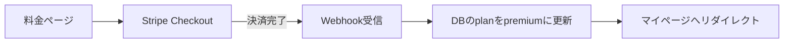

# 05. サブスク課金設計（子ドキュメント）

> 親: [00_要件定義書.md](./00_要件定義書.md)

---

## 1. 収益モデル：フリーミアム型サブスク

無料で価値を体験してもらい（集客・SEO）、「もっと学びたい」タイミングで有料化する。

## 2. プラン案

| | 無料プラン | プレミアム（案: 月額680円） |
|---|---|---|
| 図鑑閲覧 | 基本用語のみ（全体の3〜4割） | 全用語 |
| 用語検索 | ○ | ○ |
| お気に入り | 20件まで | 無制限 |
| 問題集 | 初心者モードの一部 | 全モード（初心者〜上級者） |
| 成績・学習履歴 | × | ○ |
| 広告 | （将来入れる場合）あり | なし |

- 価格は**要確認事項Q3**。年額プラン（2ヶ月分お得: 6,800円/年 など）も用意すると解約率が下がる（承認済み）
- ローンチ時の早期割引「先着◯名は永久◯%オフ」を実施（承認済み）
- 学生向け割引はフェーズ2で検討
- **スクール・専門学校向けチームプラン**（一括契約・高単価）: 個人向けが軌道に乗ったら営業（承認済み・フェーズ2）

## 3. 決済：Stripe を採用（推奨）

| 項目 | 内容 |
|---|---|
| 決済手段 | クレジットカード（MVP）。コンビニ払い等は当面なし |
| 実装 | Stripe Checkout（決済ページはStripeホスト → 実装が最小・カード情報を自前で持たない） |
| プラン管理 | Stripe Customer Portal（ユーザー自身でプラン変更・解約） |
| 同期 | Webhook（`checkout.session.completed` / `customer.subscription.updated` / `deleted`）で `subscriptions` テーブルを更新 |

### 決済フロー

## 4. アクセス制御
- 有料コンテンツ（`is_premium = true` の用語・問題）は**サーバー側で判定して出し分ける**
  - フロントで隠すだけだとAPIから中身が取れてしまうため必須
- 期限切れ（`current_period_end` 超過 & status≠active）は自動で無料プラン扱いに戻す

## 5. 法令対応（必須）
- 特定商取引法に基づく表記ページ
- 解約方法を料金ページ・設定ページに明記（ダークパターン禁止）
- 無料トライアルを付ける場合は自動課金開始日を明示

## 6. ストア公開する場合の注意
- iOS/Androidの**ネイティブアプリ内で課金する場合はストア内課金（手数料15〜30%）が必須**になる
- → まずは**Webアプリ（PWA）でStripe課金**が手数料的に有利。ストア展開はフェーズ2で判断（要確認事項Q4）

## 7. 無料版の広告収益モデル（2026-07-15 追加）

### 方針
- **無料プランのみ広告表示**。プレミアムは広告なし（＝広告非表示が課金動機のひとつになる）
- クイズの回答中には出さない（学習体験を守る）。図鑑ページ下部・結果画面下が候補枠

### 収益源は3段階で育てる
| 段階 | 収益源 | 単価の目安 |
|---|---|---|
| ① 開始直後から | Google AdSense（自動配信） | 日本平均で1PVあたり0.2〜0.5円（≒RPM 200〜500円） |
| ② 少し育ったら | アフィリエイト（ASP経由） | **プログラミングスクール案件は1成約5,000〜20,000円と高額**。読者層と相性が最高 |
| ③ 月10万PV超えたら | 純広告（掲載料金を直接請求） | 相場は「月間PV × 0.5〜2円/枠」程度。10万PVなら1枠 月5〜20万円の交渉が可能に |

### 月間PV別の見込み（AdSense＋アフィリエイト）
| 月間PV | AdSense | アフィリエイト（スクール成約） | 合計目安 |
|---|---|---|---|
| 1万PV | 2千〜5千円 | 0〜1件 ≒ 0〜2万円 | 数千円〜2万円 |
| 10万PV | 2万〜5万円 | 2〜5件 ≒ 2〜10万円 | 5〜15万円 |
| 50万PV | 10万〜25万円 | 10〜25件 ≒ 10〜50万円 | 20〜75万円 |

※ 学習・IT系読者は広告ブロッカー利用率が高めなので、AdSenseは控えめに見積もるのが安全。
※ このサイトの本命は「用語検索でSEO流入 → スクールアフィリエイト＋サブスク転換」の組み合わせ。

## 8. 価格戦略メモ（2026-07-15 検討）
- **Web版とアプリ版の二重価格はあり**（YouTube Premium等の前例あり）。例: Web 680円 / アプリ内課金 980円 として手数料分を転嫁し、アプリ内では「Webならお得」と誘導
- 日本ではスマホソフトウェア競争促進法（2025年12月施行）により外部決済への誘導が認められる方向 → アプリからWeb決済へのリンクも選択肢。実装時に最新のストア規約を確認すること
- 競合価格の目安: Progate・ドットインストール等の学習サービスは月1,000円前後。用語図鑑は範囲が狭いため**それより安い480〜800円帯**が妥当
- ローンチ時は**早期割引（先着◯名は永久◯%オフ）**や**年額プラン（2ヶ月分お得）**で初期ユーザーを獲得する
- 値上げは難しく値下げは簡単 → 迷ったら安め（480〜680円）で開始し、機能が充実したら新規向けに改定する
